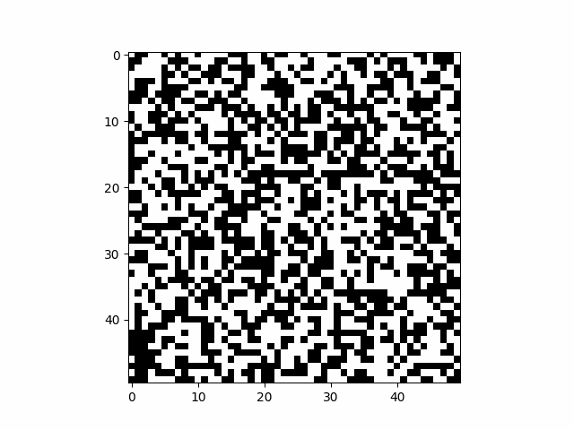

# Summary
This package implements a CLI script for generating pseudorandom noise from M-sequences. JSON metadata is generated for each run containing the generator configurations to reproduce the run.



# Installation
Tested on python 3.8, 3.10, 3.11
```
$ python3 -m pip install .

# test, dev dependencies
$ python3 -m pip install .[test, dev]
```

# Usage

## Generation
```
usage: mnoisy-gen [-h] -i IMAGE_SIZE -n NUM_FRAMES [-t FRAME_TIME_SEC] [-l SEQUENCE_LENGTH] [-s INITIAL_SEED] [-o OUTPUT_FILE]

$ mnoisy-gen -i 24 -n 3
OR
$ python -m mnoisy -i 15 -n 30 -l 10 -s 1234
```

## Reconstruction
The output filename is extracted from the metadata and prefixed with `rebuild-`
```
usage: mnoisy-rebuild [-h] -f FILENAME [-i INDEX_OF_FRAME]

$ mnoisy-rebuild -f data.json -i 26
```


# Notes
## Limitations and Assumptions
- Currently, the update function up to M-sequences of length 12 are implemented. That means image sizes are limited to 143x143 px, otherwise periodicity is introduced to the signal.

- The performance of matplotlib animation is sluggish. Running the script and updating the canvas in realtime performs poorly on my system; however the GIF that is saved to file plays back at the expected frames per second.

- Based on my understanding, an M-Sequence generates N = m*2-1 signal bits. To create an NxN image, multiple (N) sequences should be generated with different seeds then stacked to form the image.

## Considerations and Improvements
### Considerations
- The NoiseGrid generator uses the generic NoiseGenerator interface, so different subclasses may be easily implemented and injected. New generators should also be added to the factory registry.

### Improvements
- The metadata schema should be probably split into several sub schemas, corresponding to each component.
    - Using pydantic data models would simplify this validation and schema definition.
- The m-sequence update function registry and also the NoiseGeneratorFactory are pretty rudimentary (just a dict). Could use a more sophisticated implementation to register them using decorators.

- More thorough tests: I added the --debug flag to dump full frame *.npy for generating test fixtures.


# Tests
```
pip install .[test]
python -m pytest --cov=src/ tests/
```

# References
[1] https://en.wikipedia.org/wiki/Maximum_length_sequence

[2] http://www.kempacoustics.com/thesis/node83.html
